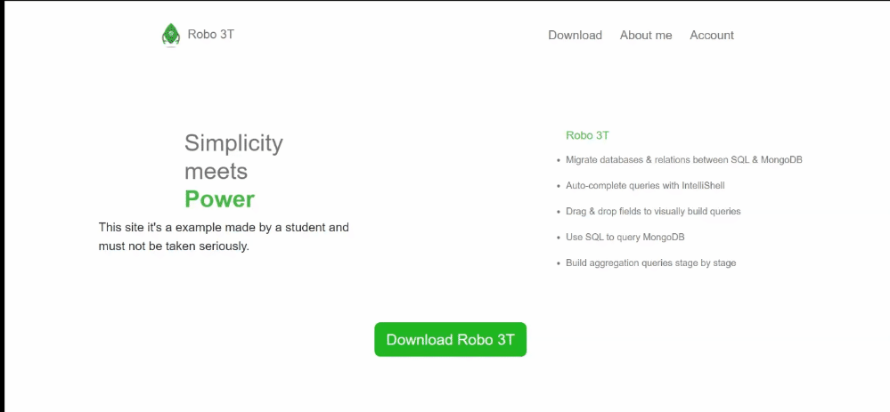
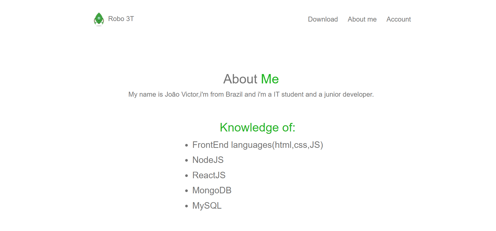
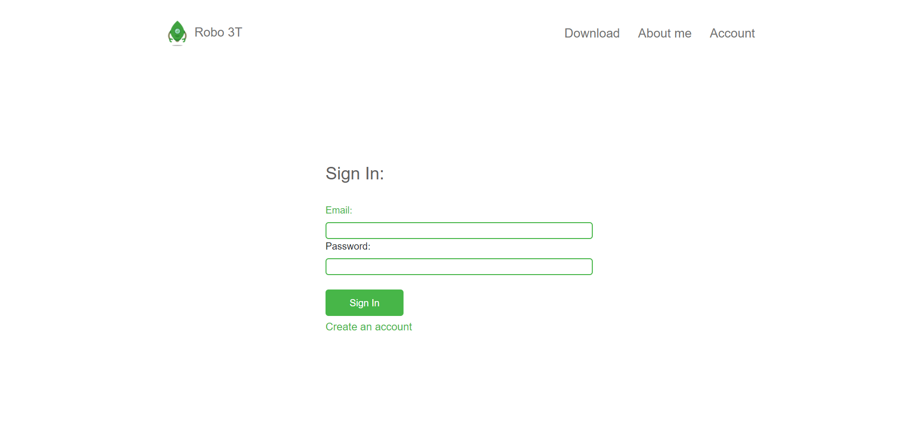

# NodeJs-Software-Website
> Software site developed as a study.

## Project Software Website
This project is a software site, totally responsive, where you can create an account or not, login and browse the site .

## About this project
This project was developed with NodeJS,handlebars,css and MongoDB and is inspired by the Robo3t software website.

### What can you do ?
- You can create an account.
- You can login.
- You can browse the site.

### How is the site?
  #### Index:
   
   
   ### Download:
   
   
   #### About me:
   
   
   ### Account:
   
   

### Stack 
1. NodeJS - as server side
2. ExpressJS - as HTTP framework
3. Mongodb - as Data base
4. Handlebars - as FrontEnd

## Want to say something?
If you have any question, suggestion or something, please feel free to open an issue. I'll be happy to answer it! :)

